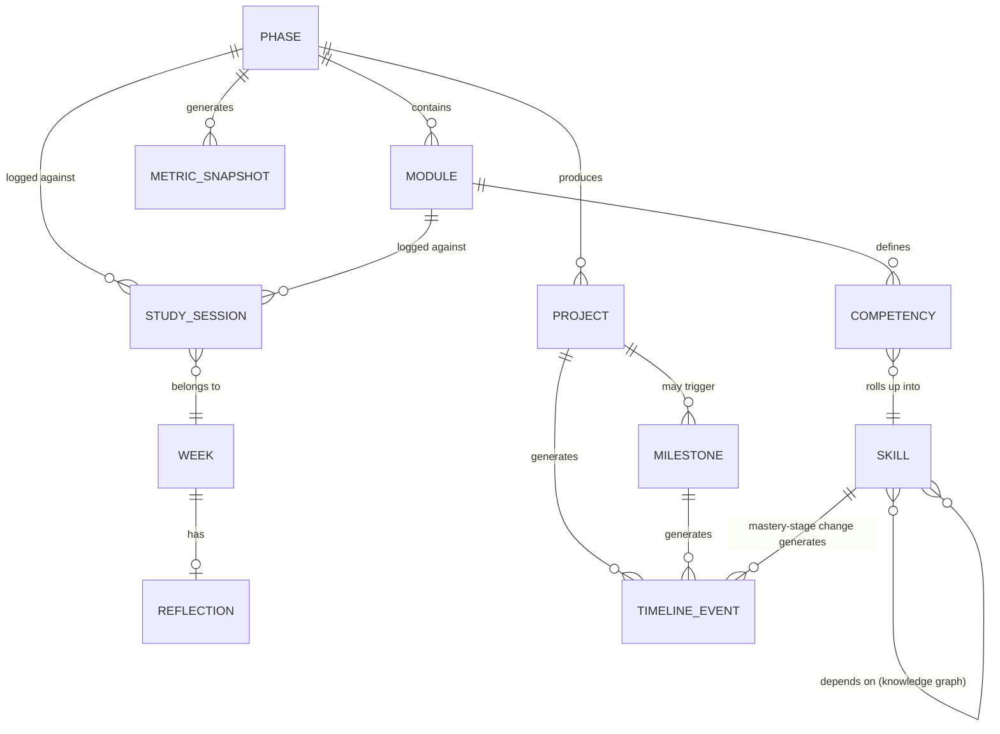
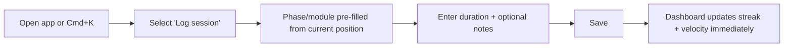
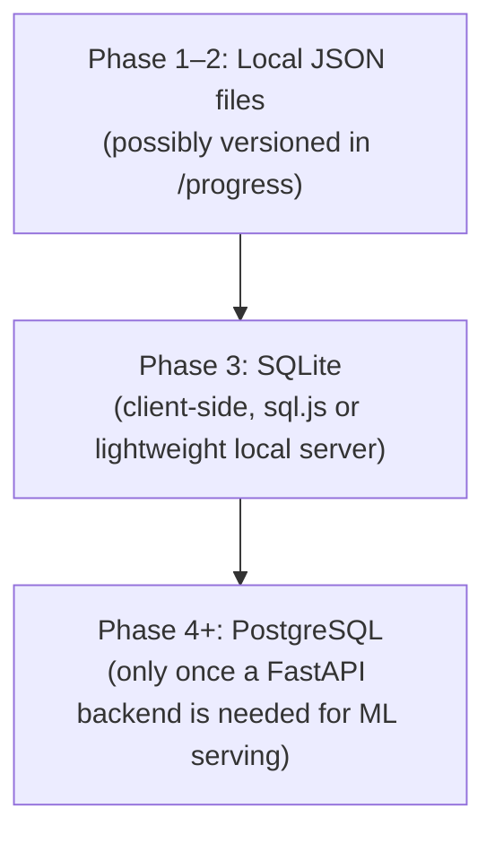
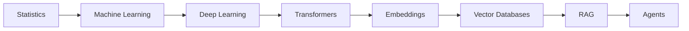

# PACI Learning Dashboard — Product Requirements Document

**Document type:** PRD (planning only — no implementation)
**Owner:** Faisal
**Status:** Draft v0.2 (post-architecture-review — see [Section 21 onward](#21-capability--growth-model) for what changed and why)
**Related:** [PACI repository README](./README.md) — this dashboard is the operational counterpart to that repository's roadmap; the README is the *plan*, this application is the *instrument* that tracks execution against it.

This document is planning-only, per the brief: no components, no file structures, no CSS, no code. Every section is written so it can be handed to an engineer (or another AI) as a build blueprint without further product decisions needing to be made first.

---

## 1. Executive Summary

The PACI Learning Dashboard is a personal Learning Operating System built to track, measure, and eventually predict progress through the PACI AI Specialization — an 18-month curriculum being compressed into an accelerated ~8.5–9-month timeline.

Unlike a generic habit tracker, this application is designed to grow in technical sophistication in lockstep with the curriculum itself: early phases get a simple, reliable tracking tool; later phases get analytics, then machine learning forecasting, then AI-assisted study tooling. The application's own architecture is intended to double as a portfolio artifact — by Phase 9, building and operating this dashboard's AI tutor *is itself* the AI Systems Engineering capstone project referenced in the PACI repository roadmap.

The current release target is a single-user, personally-hosted tool. Nothing in the architecture should block a future decision to open it up as a public template for other learners, but that is explicitly out of scope for v1.

---

## 2. Product Vision

The dashboard should feel less like a to-do list and more like an instrument panel for an engineering project — because that's what the PACI curriculum is being treated as.

Its defining property: **the tool's own capability ceiling rises exactly as fast as the user's technical capability does.** A dashboard that shipped every planned feature on day one using off-the-shelf libraries would defeat the purpose — the incremental build-out *is* the practice. Each phase of the PACI curriculum unlocks the corresponding phase of the dashboard, so the tool being used to track the learning is simultaneously a running example of the learning.

Long-term, the vision is a system that:
- Never asks the user to enter the same data twice
- Tells the truth about pace (ahead/behind schedule) without requiring manual math
- Becomes progressively more useful the longer it's used, not just more complex
- Eventually reasons over the accumulated notes and reflections well enough to act as a study assistant

---

## 3. Goals

**Primary goals** (all must be served by the MVP, not deferred):
- Track curriculum progress at the phase and module level, against the accelerated timeline defined in the PACI repository roadmap
- Record study sessions (time, topic, phase, notes) with minimal friction
- Track practical/portfolio projects from "planned" through "shipped"
- Maintain a weekly reflection journal
- Surface learning velocity (actual pace vs. planned pace) without manual calculation

**Secondary goals** (explicitly deferred to later phases, listed so scope creep into v1 can be caught early):
- Knowledge retention measurement
- GitHub activity correlation
- Long-term growth visualization beyond simple trend lines
- Any AI-powered feature

**Non-goals for this PRD:**
- Multi-user support
- Public-facing product packaging
- Mobile native app (a responsive web app is sufficient)

---

## 4. Success Metrics

Since this is a single-user internal tool, "success" is measured by whether the tool changes behavior and decisions, not by engagement metrics in the growth-hacking sense.

| Metric | Target | Why it matters |
|---|---|---|
| Study sessions logged vs. actual study sessions performed | ≥ 90% capture rate | A tracker nobody uses honestly is worse than no tracker |
| Time to log a study session | < 15 seconds | Friction is the #1 reason self-tracking tools get abandoned |
| Weekly reflection completion rate | ≥ 80% of weeks | This is the primary qualitative signal the roadmap's "Progress Philosophy" depends on |
| Schedule variance visibility | Available at a glance, no calculation required | The entire point of tracking velocity is catching drift early, per the roadmap's accelerated strategy |
| Forecast accuracy (once ML forecasting ships, Phase 4+) | Estimated completion date within ±2 weeks of actual, evaluated retrospectively per phase | An inaccurate forecast is worse than no forecast — this must be honestly evaluated, not assumed correct |
| Dashboard phase-feature parity | Dashboard's shipped phase ≤ curriculum's completed phase at all times | The dashboard should never get ahead of the skills needed to have honestly built it — see [Risks](#15-risks) |
| Engineering Score reflects real output, not activity | Score components traceable to actual artifacts (commits, shipped projects, deployed apps) — never a manually-entered number | A self-reported "engineering score" is worthless; see [Section 21](#21-capability--growth-model) |

---

## 5. User Personas

Currently one persona, described in enough depth to make product decisions unambiguous.

**Primary persona: Faisal — the user and the builder**
- Solo founder and full-stack engineer, already running production SaaS products; comfortable with software but not yet with the ML/AI-systems layer this curriculum teaches
- Uses the tool daily in short bursts (logging a study session) and weekly in a longer session (writing the reflection)
- Primary device: desktop/laptop during study and build sessions; may want quick-log capability from mobile
- Values: transparency and honesty in the data (no vanity metrics), low friction, and a tool that respects that its own construction is part of the curriculum
- Explicitly *not* a persona: a hypothetical future public user. Every "future-proofing" decision in this PRD is judged against whether it costs meaningfully more now — if it does, it's deferred, not pre-built.

---

## 6. Functional Requirements

Grouped by capability area. Each item is written as a requirement, not a feature pitch.

**Curriculum & Progress Tracking**
- The system must represent the 9 PACI phases, their official and accelerated durations, and cumulative timeline, seeded from the PACI repository roadmap
- The system must track module/phase status (not started / in progress / complete) and completion dates
- The system must compute and display schedule variance (weeks ahead/behind the accelerated plan) automatically
- **Module "complete" and module "mastered" are distinct fields, not one field.** Status tracks schedule (needed for velocity math); mastery is tracked separately via the Competency Model in [Section 21](#21-capability--growth-model). A module can be marked complete on schedule while its underlying competencies are still partially demonstrated — the dashboard must not conflate the two.

**Capability & Growth Tracking**
- The system must track granular competencies per module (not just module-level completion) — see [Section 21](#21-capability--growth-model) for the full model
- The system must compute an Engineering Score from existing tracked data (projects, GitHub activity, documentation completeness, deployment status) — it must never require separate manual data entry, per the "never enter the same data twice" product vision principle
- The system must maintain a chronological Portfolio Timeline aggregating project, deployment, skill-milestone, and engineering-milestone events — see [Section 22](#22-portfolio-timeline--engineering-milestones)

**Study Session Logging**
- The system must allow logging a study session with: date, duration, phase/module, session type (study / build / review), and free-text notes
- Logging a session must be completable in under 15 seconds for the common case (defaults pre-filled from context: today's date, current phase)

**Project Tracking**
- The system must track portfolio projects with: title, associated phase, status (planned / in progress / shipped), and a link to the artifact once shipped
- The system must distinguish "local" from "deployed" projects, matching the Deployed? column in the PACI roadmap's Portfolio Projects Overview

**Weekly Reflection**
- The system must provide a recurring weekly reflection entry (structured prompts, not a blank text box — see [User Flows](#11-user-flows))
- Reflections must be viewable chronologically as a running journal

**Analytics (Phase 2+)**
- The system must visualize study time by phase/week
- The system must visualize velocity (actual weeks elapsed vs. planned weeks) as a trend line against the roadmap's cumulative timeline

**GitHub Integration (Phase 2–3+)**
- The system should (not must, for v1) pull commit/PR activity from the PACI repository to cross-reference logged study sessions against actual commits — this is a nice-to-have correlation signal, not a primary tracking mechanism (see [Risks](#15-risks) on over-relying on proxy metrics)

**AI Features (Phase 4+)**
- Detailed in [Future AI Integrations](#14-future-ai-integrations); not functional requirements for v1

---

## 7. Non-Functional Requirements

- **Performance:** Dashboard home view must load in under 1 second on a typical broadband connection; logging a session must feel instantaneous (optimistic UI update, not waiting on network round-trip)
- **Data ownership:** All data must be exportable in a plain-text/portable format (JSON or Markdown) at any time — this is non-negotiable given the tool's role as a personal record, not a vendor-locked SaaS product
- **Data honesty:** The system must never silently drop or overwrite a logged entry; edits and deletions should be explicit user actions, not automatic cleanup
- **Privacy boundary:** Because study data may partially live inside the public PACI GitHub repository (see [Database Planning](#13-database-planning-future-ready)), the system must make a clear, enforced distinction between data safe to be public (progress stats, shipped projects) and data that should stay private (raw reflections, in-progress notes) — this must be a deliberate design decision, not an accident of where data happens to be stored
- **Reliability:** No formal uptime SLA needed for a single-user tool, but local data must survive a browser cache clear (i.e., must not rely solely on `localStorage` past the MVP stage — see Database Planning)
- **Maintainability:** Given this is being built solo, alongside the curriculum itself, the codebase must stay simple enough that a 2-week gap in active development doesn't require a re-onboarding effort to resume — this directly informs the "no gold-plating" principle already established in the PACI roadmap
- **Accessibility:** Baseline keyboard navigability and sufficient color contrast; this is a one-user tool, so WCAG AA is a reasonable target rather than a hard requirement, but it costs little to build in from the start with Tailwind's default palette discipline

---

## 8. Information Architecture

Core entities and their relationships:



- **Phase** — one of the 9 PACI phases; carries official duration, accelerated target, and status
- **Module** — sub-unit within a phase (maps to the "Core Module(s)" already defined per phase in the roadmap)
- **Study Session** — an atomic logged unit of time spent, tagged to a phase/module
- **Project** — a portfolio deliverable, tagged to a phase, with a status and optional deployed link
- **Week** — a calendar grouping used to anchor reflections and velocity calculations
- **Reflection** — one structured entry per week
- **Metric Snapshot** — a computed, point-in-time record (velocity, schedule variance) used for trend charts, so historical trend lines don't get recalculated retroactively from raw logs every time
- **Competency** — a granular, demonstrable capability tied to a module (e.g., "can tune a model's hyperparameters"), carrying a mastery stage — see [Section 21](#21-capability--growth-model)
- **Skill** — a higher-level category (e.g., "Machine Learning") that aggregates its underlying competencies into a single mastery view; skills reference other skills to encode prerequisite relationships (the Knowledge Graph)
- **Milestone** — a significant, mostly system-detected event (e.g., "first deployed application"), derived from Project/Skill state changes rather than manually logged
- **Timeline Event** — a denormalized, chronological record feeding the Portfolio Timeline; generated from Project, Milestone, and Skill changes rather than being its own primary data source

This structure is intentionally normalized from day one, even though Phase 1's storage layer (see Database Planning) won't be a relational database yet — the *shape* of the data should be stable even before the *storage mechanism* upgrades. Note that **Skill, Competency, Milestone, and Timeline Event are all derived or aggregated from data the system already collects** — none of them introduce a new manual-entry surface, which was a specific design constraint carried over from the original product vision ("never asks the user to enter the same data twice").

---

## 9. Navigation Structure

A left sidebar, persistent across views (Linear/Notion-style), with a command palette (Raycast-style, `Cmd+K`) as the fast path for logging — power-user speed matters more than menu depth for a single-user tool.

```
Sidebar
├── Dashboard (home / overview)
├── Curriculum
│   └── Phase 1 … Phase 9 (expandable, shows modules)
├── Study Log
├── Projects
├── Reflections
├── Analytics                  (Phase 2+)
├── Growth                     (Phase 2+ — Skill Tree · Knowledge Graph · Engineering Score, as tabs of one view)
├── Portfolio                  (Phase 2+ — chronological Portfolio Timeline)
└── Settings
```

- **Dashboard** is the default landing view — see [Dashboard Layout](#12-dashboard-layout)
- **Curriculum** is the drill-down view mirroring the roadmap's phase structure exactly, so there's never a mismatch between what the README says and what the app shows
- **Growth** is deliberately one nav item with three tabs (Skill Tree, Knowledge Graph, Engineering Score) rather than three separate top-level items — these are three views over the same underlying competency data (see [Section 21](#21-capability--growth-model)), and giving each its own sidebar slot would violate the "no dashboard with 40 widgets" principle already established in [UX Principles](#19-ux-principles)
- **Portfolio** is the Portfolio Timeline — see [Section 22](#22-portfolio-timeline--engineering-milestones). This is also the view a future public read-only mirror (see [Future Expansion Ideas](#20-future-expansion-ideas)) would expose almost as-is
- **Command palette** (`Cmd+K`) should support at minimum: "Log a study session," "New reflection," "Jump to phase," "New project" — this is the primary interaction for daily use, with the sidebar existing for browsing rather than data entry

---

## 10. Feature Breakdown

Features are grouped by the dashboard's own phase-gated rollout, mirroring the phase progression already defined in the project brief. Each feature is tagged with MoSCoW priority *within its phase*.

> **Sequencing note (added in review):** not every sophisticated-sounding feature needs to wait for a matching curriculum phase. Some features are gated by *technical skill not yet learned* (e.g., ML forecasting genuinely needs Phase 4's content). Others are gated only by *data not yet accumulated* — they're ordinary CRUD-and-visualization work, buildable with Phase 1–2 skills, and just need enough logged history to be meaningful. The Capability & Growth Model ([Section 21](#21-capability--growth-model)) and Portfolio Timeline ([Section 22](#22-portfolio-timeline--engineering-milestones)) fall into the second category and are pulled forward into Phase 1–2 below, rather than sitting artificially behind later phases.

### Dashboard Phase 1 — Foundation (ships with PACI curriculum Phase 1)
- Curriculum phase/module tracker with status and dates — **Must**
- Study session logging (manual entry) — **Must**
- Weekly reflection (structured prompts) — **Must**
- Project tracker (planned/in progress/shipped) — **Must**
- Basic home dashboard (current phase, streak, recent activity) — **Must**
- Data export (JSON/Markdown) — **Should**
- Minimal Engineering Score (project count + deployment status only — no GitHub integration yet) — **Should**
- Engineering Milestones, system-detected from Project state changes (e.g., "first project shipped") — **Should**
- Static Knowledge Graph reference view (no live mastery overlay yet — just the curated concept map) — **Could**

### Dashboard Phase 2 — Analytics
- Study time by phase/week charts (Recharts) — **Must**
- Velocity trend line vs. planned timeline — **Must**
- Study session statistics (avg session length, sessions/week) — **Should**
- Streak and consistency visualization — **Could**
- Competency tracking per module (replaces binary "complete" with the mastery-stage model) — **Must**
- Skill Tree, aggregating competency data into the category view — **Must**
- Knowledge Graph mastery overlay (nodes colored by current skill stage) — **Should**
- Full Engineering Score (adds GitHub activity and documentation-completeness scoring) — **Should**
- Portfolio Timeline (chronological project/deployment/milestone/skill feed) — **Must**

### Dashboard Phase 3 — Structured Storage
- Migration of the data layer from flat-file/local storage to SQLite — **Must**
- This is the natural point to introduce a real query layer, since it's exactly when the curriculum itself teaches SQL — the migration *is* practice, not incidental infrastructure work

### Dashboard Phase 4 — Predictive Analytics
- Estimated completion date, computed from actual logged velocity vs. remaining phases — **Must**
- Performance forecasting (projected schedule variance if current pace continues) — **Should**
- Explicit confidence/uncertainty display on any forecast — **Must** (see [Risks](#15-risks) — an unlabeled point-estimate forecast from a small dataset is actively misleading)

### Dashboard Phase 5 — Recommendations
- Study recommendations based on logged weak areas / self-rated confidence — **Must**
- Suggested review timing based on spaced-repetition heuristics — **Should**
- Recommendations weighted by Knowledge Graph position — a weak foundational skill (e.g., Statistics) is flagged with higher priority than a weak downstream skill, since everything built on top of it is put at risk — **Should** (this upgrades the recommendation logic from a flat heuristic to one that uses the dependency structure already captured in [Section 21](#21-capability--growth-model), rather than treating every weak area as equally urgent)

### Dashboard Phase 6 — AI Assistant
- Conversational assistant that can answer questions about the user's own logged notes/reflections (retrieval over personal data, not yet a full RAG pipeline) — **Must**

### Dashboard Phase 7 — Advanced Analytics
- Correlation analysis (e.g., session length vs. self-rated confidence trend) — **Should**
- Anomaly detection on study patterns (e.g., flagging an unusual multi-week gap before it becomes a full derailment) — **Could**

### Dashboard Phase 8 — Optional OCR
- Ingest photographed/handwritten notes via OCR into the reflection or notes system — **Could** (explicitly optional, as already labeled in the brief — see [Risks](#15-risks) for why this stays low priority)

### Dashboard Phase 9 — AI Systems Capstone
- Full RAG pipeline over all accumulated notes, reflections, and project write-ups — **Must**
- Vector database-backed semantic search across the entire learning history — **Must**
- Agent-style personalized tutor that can reason across the full corpus (e.g., "what have I already learned that's relevant to X") — **Must**

---

## 11. User Flows

**Flow A — Daily study session logging (the most frequent action; must be near-frictionless)**



**Flow B — Weekly reflection**
1. On a defined weekly cadence (configurable day, default Sunday), the dashboard surfaces an unfilled reflection prompt on the home view.
2. Structured prompts (not a blank box): *What shipped this week? Where did the plan and reality diverge? What's the one thing to change next week?*
3. On save, the reflection is timestamped to its Week entity and becomes part of the chronological journal.
4. If a week passes with no reflection, it's shown as a visible gap in the journal — not backfilled or hidden, per the [Non-Functional Requirements](#7-non-functional-requirements) data-honesty principle.

**Flow C — Completing a phase**
1. User marks the final module of a phase complete (or the system infers it from all modules being complete).
2. The dashboard prompts a phase retrospective (short structured summary, matching the `/progress` retrospective convention already defined in the PACI roadmap).
3. A metric snapshot is recorded (actual weeks taken vs. planned) — this is what powers the velocity trend line without needing to recompute history later.
4. If the completed phase's dashboard-feature-tier is unlocked (per [Feature Breakdown](#10-feature-breakdown)), a one-time notice surfaces: *"Phase N complete — [feature] is now available."*

---

## 12. Dashboard Layout

Described as content regions, not components or markup.

- **Top bar:** current phase indicator, schedule variance (e.g., "3 days ahead of plan"), command palette trigger
- **Primary column (left, widest):**
  - Current phase card — phase name, progress bar, modules remaining
  - Recent activity feed — last few study sessions and project updates
  - This week's reflection status — prompt if unfilled, summary if filled
- **Secondary column (right, narrower):**
  - Streak/consistency widget
  - Upcoming milestone (next entry from the roadmap's Milestones table)
  - Quick-log button (redundant with command palette, for discoverability — power users will use `Cmd+K`, but a visible button matters for a tool used at the end of a tiring study session)
- **Below the fold:** velocity trend chart (Phase 2+), spanning full width

Design intent: the home view should answer "am I on track?" within two seconds of opening the app, without requiring the user to visit a separate analytics page. Analytics goes deeper; the dashboard home is a status check.

---

## 13. Database Planning (future-ready)

The storage layer is deliberately staged to match the curriculum, rather than over-built on day one.



**Phase 1–2 — flat files, no database.** Data lives as structured JSON (or Markdown with frontmatter, to stay consistent with the PACI repository's own documentation style) — plausibly even committed into the repository's `/progress` folder, which would make the dashboard's data literally part of the public engineering journal. This avoids standing up a database before there's any curriculum-driven reason to.

**Phase 3 — SQLite.** This is the natural point to introduce a real relational store, because it's exactly when the SQL curriculum phase happens. The entity model defined in [Information Architecture](#8-information-architecture) maps directly to tables: `phases`, `modules`, `study_sessions`, `projects`, `weeks`, `reflections`, `metric_snapshots`, `competencies`, `skills`, `milestones`, `timeline_events`. The last four are new since the architecture review ([Section 21](#21-capability--growth-model)) but don't change the migration's shape or timing — they're the same kind of structured records as everything else already planned for this migration.

**Phase 4+ — PostgreSQL, behind FastAPI.** A real backend only becomes necessary once server-side computation is required — specifically, running ML forecasting models, which isn't practical purely client-side. Introducing FastAPI at this point (rather than from day one) means the backend gets built exactly when the curriculum has taught the skills to build it properly, and avoids maintaining a server for the ~5 months of curriculum time before it's actually needed.

This staged approach is a deliberate refinement of the stated preference ("SQLite initially, PostgreSQL later") — the recommendation here is to also delay *any* database (SQLite included) until Phase 3, rather than starting with SQLite on day one. The reasoning: Phase 1–2 data volume and complexity don't justify a database, and standing one up early would be exactly the kind of "gold-plating on non-core work" the PACI roadmap already commits to avoiding.

---

## 14. Future AI Integrations

Each AI feature is tied to the curriculum phase that teaches the skill required to build it — this is the core product mechanic, not a bolt-on roadmap.

- **Phase 4 — Predictive completion & performance forecasting:** A regression model (or even a simple weighted moving average as a defensible baseline before reaching for anything fancier) over logged velocity, predicting completion date and flagging schedule risk. Given the curriculum's own Machine Learning Backbone phase covers exactly this, the honest move is to *start* with a simple statistical baseline and treat "does a trained model beat the baseline" as the actual test — not assume a model is better by default.
- **Phase 5 — Study recommendations:** Rule-based initially (e.g., "no session logged against Module X in 10 days, and self-rated confidence was low"), upgraded to a lightweight recommendation model once there's enough historical data to justify it. A recommendation engine trained on a single user's few hundred data points should be viewed skeptically — see [Risks](#15-risks).
- **Phase 6 — AI learning assistant:** Retrieval over personal notes/reflections (not yet full RAG) — the assistant can answer "what did I write about X" accurately, without yet reasoning across sources.
- **Phase 7 — Advanced analytics:** Statistical, not AI — correlation and anomaly detection using standard techniques, deliberately kept out of "AI" framing since dressing up a rolling z-score as "AI-powered insight" would undercut the tool's own honesty principle.
- **Phase 8 — OCR (optional):** Ingest scanned/handwritten notes into the reflection/notes system.
- **Phase 9 — RAG + vector database + agent + personalized tutor:** The capstone integration — a full retrieval-augmented pipeline over the entire accumulated corpus (notes, reflections, project write-ups, even past study session context), with an agentic layer that can act on it (e.g., "quiz me on what I haven't reviewed in 3 weeks"). This is explicitly the same deliverable that could serve as the AI Systems Engineering capstone project referenced in the PACI repository roadmap — worth updating that document to point at this feature once it's underway, rather than building two separate capstone projects.

---

## 15. Risks

- **Feature-tier scope creep.** The phase-gated feature model is a strong narrative device, but it creates pressure to build the *next* tier's feature before the current tier is solid, just because it's "unlocked." Mitigation: a phase's dashboard features are not started until that phase's curriculum content is actually complete, not just "close enough" — enforce this the same way the roadmap already enforces Definition of Done for curriculum phases.
- **Knowledge retention is asked for but not well-defined.** "Measure knowledge retention" (from the Product Goals) implies something like spaced-repetition forgetting curves, which requires a quizzing mechanism that doesn't exist yet. Recommendation: for v1, replace true retention measurement with a self-rated confidence score per module, revisited periodically — an honest proxy rather than a fake-precise metric. Build real retention testing (e.g., periodic recall quizzes) only if the proxy turns out to be insufficient in practice.
- **Small-sample forecasting can mislead.** Any ML-based completion forecast (Phase 4) trained on a few months of a single user's data will have wide, real uncertainty. Displaying a confident-looking date without an uncertainty band would actively work against the roadmap's "results are reported honestly" engineering standard. Mitigation: always pair forecasts with a confidence range and the baseline they're being compared against.
- **Public/private data boundary.** Because the parent repository is intentionally public, there's real risk of a private reflection or an unflattering note about a bad week ending up committed to a public GitHub repo by accident. This needs an explicit, enforced separation (see Non-Functional Requirements), not just a convention to "remember."
- **OCR is a low-value feature wearing a high-effort costume.** Building OCR ingestion is a legitimate computer-vision practice project, but as a *dashboard feature* it adds real complexity (image handling, storage, accuracy issues) for a feature that will likely be used rarely. Keep it optional and low priority, exactly as already labeled — don't let "it's a good CV project" argument smuggle it into a higher priority than the core tracking features.
- **Solo maintenance load.** Building this dashboard *while* doing the curriculum it tracks is inherently at risk of the tool falling behind or being abandoned mid-build during a heavy study phase. Mitigation: the MVP (Dashboard Phase 1) must be genuinely minimal enough to build in a few days, not weeks, so it's providing value almost immediately rather than becoming its own multi-month project that competes with the curriculum for time.
- **Metric gaming, even against yourself.** A tool that shows "velocity" and "streaks" prominently creates a subtle incentive to log sessions for the sake of the metric rather than log honestly. This is worth being aware of, not something the software can fully prevent — but structured reflection prompts (rather than only quantitative metrics) help keep the qualitative signal in the loop.
- **Composite scores becoming black boxes.** The Engineering Score ([Section 21](#21-capability--growth-model)) aggregates several inputs into one number — if the UI only ever shows the number, it stops being informative and starts being a vanity metric, exactly the failure mode the Success Metrics section already commits to avoiding. Mitigation: the score's component breakdown must always be visible alongside it, never hidden behind a tooltip.
- **Career Readiness scope creep.** The full career-tracking feature list requested in review (interview prep, personal branding, certifications) risks turning a focused learning tracker into an unfocused career-management platform. Scoped down in [Section 23](#23-career-readiness-post-paci) — worth re-reading before implementation if the temptation to build the full list resurfaces.

---

## 16. Development Roadmap

This mirrors the PACI curriculum's own cumulative timeline (see the PACI repository README's Timeline Overview) — the dashboard is not on an independent schedule.

| Dashboard Phase | Ships alongside curriculum phase | Cumulative week (approx., per PACI roadmap) |
|---|---|---|
| 1 — Foundation | Phase 1 | Week 1–6 (built early in the phase, used for the rest of it) |
| 2 — Analytics | Phase 2 | Week 6–10 |
| 3 — SQLite migration | Phase 3 | Week 10–12 |
| 4 — Predictive analytics | Phase 4 | Week 12–21 |
| 5 — Recommendations | Phase 5 | Week 21–25 |
| 6 — AI assistant | Phase 6 | Week 25–29 |
| 7 — Advanced analytics | Phase 7 | Week 29–33 |
| 8 — OCR (optional) | Phase 8 | Week 33–35 |
| 9 — RAG/agent/tutor | Phase 9 | Week 35–37 |

Note the Phase 1 dashboard should ship *early* within curriculum Phase 1 (ideally within the first week or two), since it needs to be operational to track the rest of the curriculum — building the tracker is not itself curriculum content, so it shouldn't consume a meaningful share of Phase 1's 6-week budget.

---

## 17. Version Planning

Semantic versioning, with major version bumps reserved for genuinely structural shifts rather than every feature tier:

- **v0.1 – v0.3:** Dashboard Phases 1–3 (foundation through SQLite migration). Pre-1.0 because the data model and storage layer are still expected to change.
- **v1.0:** Ships with Dashboard Phase 4 (predictive analytics) — the first release where the tool does something beyond record-keeping, and the data model is expected to be stable going forward.
- **v1.x:** Dashboard Phases 5–7 (recommendations, AI assistant, advanced analytics) as minor version bumps — additive capability, no breaking changes to the existing data model.
- **v1.x (optional):** Phase 8 (OCR), if pursued.
- **v2.0:** Dashboard Phase 9 — the RAG/vector-database/agent capstone is a genuine architectural shift (introduces a vector store and an agent runtime), warranting a major version bump.

---

## 18. Technical Recommendations

**Frontend — confirmed as proposed:** React + TypeScript + Vite + Tailwind CSS. This is a good fit: Vite's dev experience is fast enough not to create friction during study sessions, TypeScript pays for itself once the data model in Section 8 has more than a couple of entities, and Tailwind matches the "modern cards, generous spacing" design direction without needing a heavier design-system dependency this early.

**Backend — FastAPI, but deferred (see Database Planning):** Confirmed as the right eventual choice given Python is already the language of the ML/AI curriculum phases — no reason to introduce a second backend language. The refinement is *timing*: don't stand up FastAPI until Dashboard Phase 4 needs server-side inference. Building it earlier "for future-readiness" would just be an idle server for months.

**Database — staged, not fixed from day one:** See [Database Planning](#13-database-planning-future-ready). Flat files → SQLite (Phase 3) → PostgreSQL (Phase 4+), each introduced exactly when the curriculum has taught the skill to build it properly.

**Charts — Recharts confirmed.** Good React-native fit, sufficient for time-series and bar/line charts needed through Dashboard Phase 7; no need for a heavier charting library (e.g., D3 directly) unless a specific visualization genuinely can't be expressed in Recharts — cross that bridge if it's actually reached.

**State management — not specified in the brief, worth flagging now:** For an app of this data shape, React's built-in state + context is likely sufficient through Dashboard Phase 2–3; a dedicated state library (e.g., Zustand) is worth introducing only if prop-drilling or state-sync pain actually shows up — not pre-emptively.

**Deployment — Vercel (frontend) + Render/Railway (backend, once it exists) confirmed.** Both are reasonable, low-maintenance choices for a solo-maintained project; no changes recommended. Until Dashboard Phase 4, there's no backend to deploy at all — the app is a static Vite build with local/file-based storage.

**Testing strategy (not in the original stack list, worth adding):** Given the "maintainability" non-functional requirement, a lightweight testing setup (Vitest, since it pairs naturally with Vite) is worth introducing from Dashboard Phase 1 for the core data-transformation logic (velocity calculation, schedule variance) — not for UI, which will change too often early on to be worth testing yet.

---

## 19. UX Principles

Directly informed by the stated inspirations (Linear, GitHub, Notion, Raycast, Vercel Dashboard):

- **Clarity over decoration.** Every screen should answer one primary question ("am I on track," "what did I do this week") without requiring the user to interpret a chart.
- **Command-first interaction.** A `Cmd+K` palette is not a nice-to-have here — it's the primary interaction for the single most frequent action (logging a session). Menu-clicking should be the fallback path, not the default.
- **Generous whitespace, card-based grouping.** Matches all five named inspirations; avoids the "dashboard with 40 widgets" failure mode common in tracking tools.
- **Restrained motion.** Transitions should communicate state change (a session was saved, a phase was completed) — not decorate idle screens. This directly serves the "usability over excessive animation" instruction.
- **Progressive disclosure by design, not accident.** Since features are genuinely gated by dashboard phase, the UI should never show a greyed-out "coming soon" AI tab for six months — unbuilt features simply shouldn't appear in navigation yet. This is both an honest reflection of what exists and consistent with the phase-unlock narrative.
- **Data-dense but organized, GitHub-style.** Tables and lists (study log, project list) should favor information density over card-per-item sprawl once entries accumulate — a long list of study sessions should read like a GitHub commit history, not a Pinterest board.
- **Dark mode as default, light mode as option.** Consistent with every named inspiration product; low cost to support both if Tailwind's theming is set up from the start.

---

## 20. Future Expansion Ideas

Explicitly out of scope for the roadmap above, but worth recording so they aren't lost:

- **Generalize beyond PACI-specific content.** The underlying data model (phases → modules → sessions → reflections → metrics) isn't actually PACI-specific — it's a general structured-curriculum tracker. Given the earlier interest in building a more general personal "Learning OS," this dashboard's architecture is a plausible foundation for that broader tool once PACI itself is complete. This idea was evaluated in more depth during architecture review — see [Section 24](#24-product-vision-evolution--scope-boundary-review) for the reasoning on why it stays a *future* idea rather than a v1/v2 restructure.
- **Public read-only mirror.** A stripped-down, public-safe view (progress stats and shipped projects only, no private reflections) could sit alongside the public GitHub repository as a live progress page — useful as a portfolio artifact for anyone evaluating the work.
- **Calendar integration.** Auto-suggesting or time-blocking study sessions based on historical patterns, once there's enough data to make that suggestion meaningful rather than arbitrary.
- **Multi-curriculum support.** If the tool is ever generalized (see above), supporting more than one concurrent curriculum/track becomes relevant — explicitly not needed for PACI alone.
- **Export to a portfolio/resume artifact.** A generated summary (e.g., "9 phases, N projects shipped, X months") that could be dropped directly into a portfolio site or resume once the curriculum is complete.

---

## 21. Capability & Growth Model

Four capabilities were requested in review — Engineering Score, AI Readiness Score, Skill Tree, and Knowledge Graph. They're grouped into one section because they turned out, on review, to be four views over **one underlying dataset** (competencies and their mastery stages), not four independent systems. Building them as separate data models would mean entering the same information multiple times, which directly violates the product vision's "never asks the user to enter the same data twice" principle. The subsections below define the one shared model and then each view.

### 21.1 The shared model: mastery stages

Every competency and every skill uses the same four-stage vocabulary, so there's one taxonomy to reason about, not two competing ones:

1. **Introduced** — encountered the concept (a study session logged against it)
2. **Practiced** — completed exercises or guided work
3. **Applied** — used it in a real project, not just an exercise
4. **Mastered** — can explain the tradeoffs and teach it, evidenced by a written note/reflection referencing it, or a project where it was a deliberate design choice, not a default

A **Skill's** stage is derived from its underlying **Competencies** (e.g., a skill reaches "Applied" once a majority of its tagged competencies are at "Applied" or above) — this is a computed rollup, not a separately-entered value.

### 21.2 AI Readiness / Competency Model

Replaces the original PRD's binary module-complete checkbox with a granular capability checklist per module. Module completion (a schedule field, used for velocity math) stays as-is; competency mastery is the new, separate layer underneath it — see the updated [Functional Requirements](#6-functional-requirements).

Illustrative example (Machine Learning Backbone phase, as given in review):
- Can train a model
- Can evaluate a model against appropriate metrics
- Can compare algorithms for a given problem
- Can tune hyperparameters
- Can explain tradeoffs between approaches
- Can deploy a model behind an interface

A second example, to confirm the pattern generalizes cleanly (Deep Learning Systems phase):
- Can build a training loop from scratch (not just call `.fit()`)
- Can diagnose an underfitting vs. overfitting run from its training curves
- Can apply transfer learning to a new task
- Can explain why a chosen architecture fits the problem

**Scope note:** authoring the full competency checklist for all 9 phases is a content task, not a product-design task — it belongs in a seed-data file (or `/notes`) written phase-by-phase as each phase's curriculum content is finalized, not hand-written wholesale in this PRD. The two examples above are the normative pattern to repeat.

### 21.3 Skill Tree

A visual aggregation layer over competency data — not a separately maintained dataset. Categories, as specified in review: Programming, Data, Machine Learning, Deep Learning, Computer Vision, LLMs, RAG, Agents (Git and OOP live under Programming; NumPy/Pandas/SQL under Data).

Each skill node displays its current mastery stage (of the four defined above) and, on expansion, the competencies rolling up into it. Visually: a tiered layout (categories as columns or branches, skills as nodes within them), with stage communicated by fill/color rather than a raw percentage — percentages imply false precision for a four-stage qualitative scale.

Ships in Dashboard Phase 2, once there's enough competency data logged to make the visualization meaningful — see the sequencing note in [Feature Breakdown](#10-feature-breakdown).

### 21.4 Knowledge Graph

A **hand-curated, static** concept-dependency graph — deliberately not auto-generated. Example core chain, as specified in review:



**Why static and curated, not inferred:** automatically extracting a concept-dependency graph from notes (e.g., via an LLM) is tempting given the curriculum eventually teaches exactly the tools to do it, but it's a research-level NLP problem being reached for to solve a 30–60 node graph a human can author correctly once in an afternoon. A hallucinated dependency edge is worse than a missing one — it would actively mislead the recommendation engine described below. This is explicitly deferred, not planned, even for Phase 9.

**Why it matters beyond visualization:** the graph is what upgrades Dashboard Phase 5's recommendation feature from a flat heuristic ("this module is weak") to a prioritized one ("this *foundational* module is weak, and three other skills depend on it") — see the updated [Phase 5 feature entry](#10-feature-breakdown).

Ships as a static reference view in Phase 1 (no live data needed — it's a fixed content asset), with the live mastery-stage color overlay added once Skill Tree data exists in Phase 2.

### 21.5 Engineering Score

A composite, computed score reflecting engineering *output*, not study activity — deliberately separate from the velocity/streak metrics already in the dashboard, which measure consistency, not production.

| Component | Source (existing data, not new manual entry) | Notes |
|---|---|---|
| Projects shipped | Project entity status | Weighted by status: planned < in progress < shipped |
| Deployment progress | Project "deployed" flag | Matches the roadmap's Deployed? classification (local/optional/live/live-monitored) |
| GitHub activity | Existing GitHub integration (already a "should" in [Functional Requirements](#6-functional-requirements)) | Commit frequency and recency, not raw commit count — avoids rewarding commit-spam |
| Documentation quality | Project README completeness, checked against the PACI repository's own [Engineering Standards](./README.md#engineering-standards) | Reuses an existing rubric instead of inventing a second one |
| Technical writing | Weekly reflections + notes entries logged | Volume-agnostic — presence and consistency, not word count |
| Code quality | *Deferred* — not scored until automated tooling (linting, coverage) is introduced later in the curriculum; a placeholder "not yet measured" state is shown rather than a fabricated number | Avoids a fake-precise score on a dimension with no real signal yet |

The score is computed at phase-retrospective time (not continuously recalculated on every page load), matching the cadence already established for metric snapshots. **The breakdown must always be shown alongside the total** — see the corresponding entry in [Risks](#15-risks) on composite scores becoming black boxes.

Ships as a minimal version (projects + deployment only) in Phase 1, full version (adding GitHub and documentation scoring) in Phase 2.

---

## 22. Portfolio Timeline & Engineering Milestones

A single chronological feed, not two separate systems. **Engineering Milestones are a specific, mostly system-detected event type within the Portfolio Timeline** — treating them as a separate manually-maintained list would be redundant with data the Project and Skill entities already hold.

**Event types in the timeline:**
- Project created / status changed / deployed
- Skill reaching a new mastery stage
- Phase completed (cross-referenced from the existing phase-completion flow)
- Milestones (see below)

**Milestone detection, as concrete examples (mostly automatic, not manually logged):**
- *First Python project* — first Project tagged with the Programming Foundation phase
- *First deployed application* — first Project with `deployed = true`
- *First machine learning model* — first Project tagged Machine Learning Backbone or later with a "model" artifact type
- *First FastAPI backend* — first Project tagged with a backend component, once the dashboard's own Phase 4 backend exists to detect this against
- *First computer vision project* — first Project tagged Computer Vision Deployment
- *First AI Agent* / *First RAG application* — first Project tagged Phase 9
- *First production deployment* — first Project with `deployed = true` **and** monitored (matching the roadmap's "Live, monitored" tier)

A milestone that can't be reliably auto-detected (there will be a few) falls back to a manual "mark this as a milestone" action on an existing timeline event — never a separate free-form milestone-creation form, to avoid a second data-entry surface.

**Product role:** this is also the primary candidate surface for the "public read-only mirror" idea already listed in [Future Expansion Ideas](#20-future-expansion-ideas) — a public version of this exact view, minus anything tagged private.

Ships in Dashboard Phase 1 (milestones, since they're simple state-change detection on data already being tracked) and Phase 2 (the full chronological timeline view, once there's enough history to make a timeline worth looking at).

---

## 23. Career Readiness (Post-PACI)

Review requested a full "Career Dashboard": portfolio completion, resume readiness, GitHub history, open-source contributions, technical articles, certifications, interview preparation, and personal branding progress.

**Assessment:** roughly half of this list is a natural, low-cost extension of data already tracked. The other half is a meaningfully different product.

**In scope, as a lightweight "Career Readiness" panel:**
- Portfolio completion — derived directly from the Portfolio Timeline, no new tracking needed
- GitHub contribution history — already required for the Engineering Score; this is a different view of the same data
- Technical articles — a simple list (title, link, date), adjacent to the existing reflections/notes system
- Certifications — a simple list; low cost to include, no reason to build tooling around it

**Explicitly out of scope, with reasoning:**
- **Interview preparation** — this wants spaced practice questions, mock-interview flows, and a question bank: a genuinely different feature shape from a learning tracker, closer to its own product. Including it here would be the same "gold-plating on non-core work" the PACI roadmap already commits to avoiding.
- **Personal branding progress** — this wants a content calendar and scheduling, not a data model extension. Same reasoning: a different tool wearing this one's name.

**Sequencing:** this panel is gated by *time* (does PACI exist to have a "post-" state) rather than by *skill*, so it doesn't fit the Dashboard Phase 1–9 model at all. It belongs in version planning as a **v2.1+** addition, after the Phase 9 capstone ships, not folded into the phase-gated roadmap.

---

## 24. Product Vision Evolution — Scope Boundary Review

Review asked whether this should remain a PACI-specific dashboard or become one learning roadmap inside a broader "AI Engineering Operating System."

**The case for generalizing now:** the entity model (phases → modules → competencies → skills → projects → reflections) was already curriculum-agnostic in shape before this review, and there's a documented prior interest in a more general personal "Learning OS." The intuition behind the request is sound.

**The case against generalizing now — and the recommendation:** building a multi-curriculum abstraction (a curriculum-switcher, a tenant-like model for "which program is this data for") before a second real curriculum exists to design against means designing for an imagined second case instead of a validated one. That's the same mistake the roadmap's own "no gold-plating on non-core work" principle already exists to prevent, applied one layer up — at the architecture level instead of the feature level.

**Verdict: keep the product PACI-specific in naming and scope through v2 (through the Phase 9 capstone).** Concretely:
- Continue writing entities generically internally (already true — nothing is literally hardcoded as "PACI" in the data model), but don't build a curriculum-selection UI, multi-tenancy, or a "add a new curriculum" flow
- Revisit the generalization question after Phase 9 ships, using real operating experience with *one* curriculum as the design input — not speculation about what a second curriculum might need
- If revisited, the correct trigger is "there is now a second real curriculum to build this against," not "the architecture happens to already support it"

This directly updates the corresponding entry in [Future Expansion Ideas](#20-future-expansion-ideas), which should be read as "plausible future direction, deliberately not pursued yet" rather than a near-term roadmap item.

---

## Summary

This PRD deliberately under-builds early and over-plans late: Dashboard Phase 1 is close to the minimum viable tracker, while the database, backend, and AI layers are staged to arrive exactly when the curriculum has taught the skill to build them well — not before. The main product risk isn't ambition, it's sequencing: building AI or infrastructure ahead of the skill to build it properly would quietly contradict the PACI repository's own engineering standards. Every phase gate in this document exists to prevent that.

**Post-review addition:** the capability model (Section 21) extends this same discipline to *measuring* growth, not just scheduling it — every new score, skill view, and milestone is derived from data the system already collects, never a second place to enter the same fact twice. The one place ambition was deliberately cut back, rather than staged, is Career Readiness (Section 23): about half of what was requested there is a different product wearing this one's name, and was scoped out rather than deferred.
