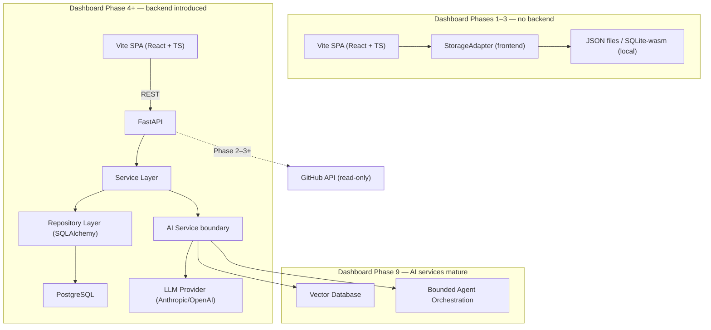
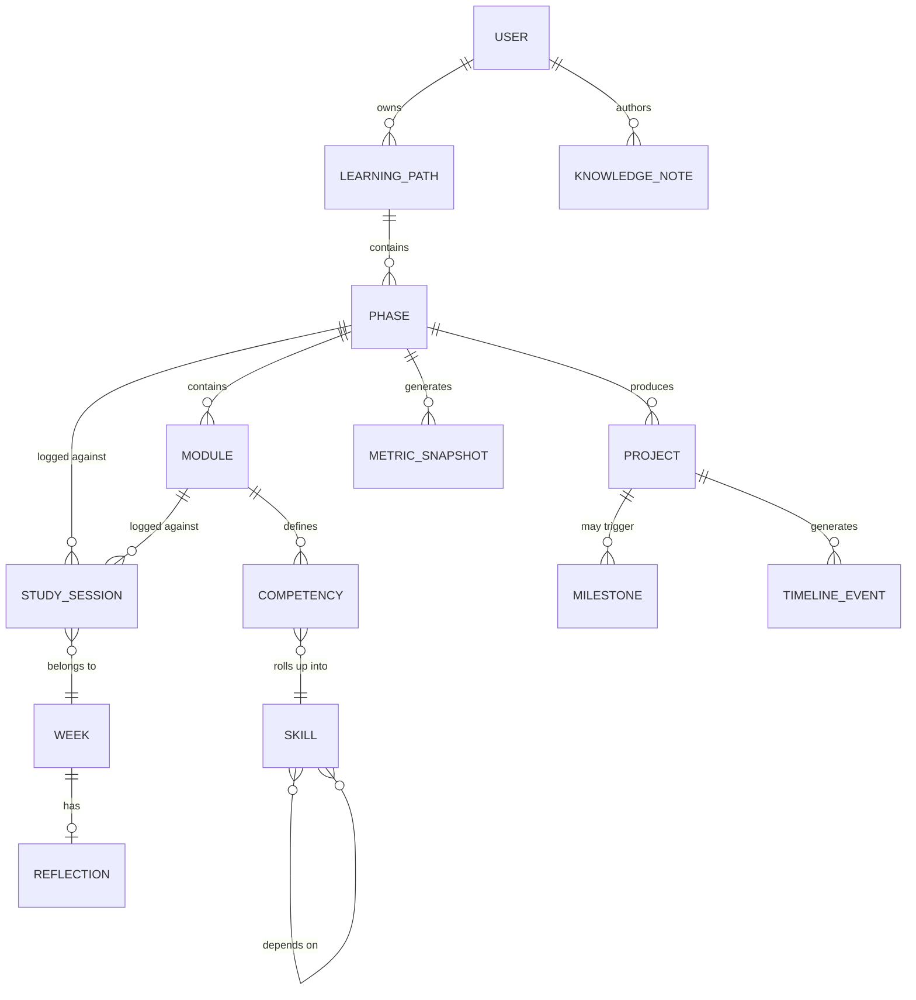
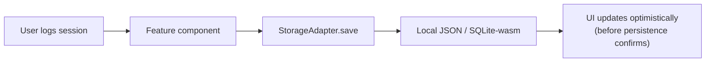
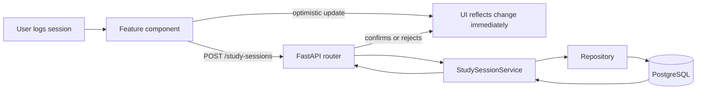
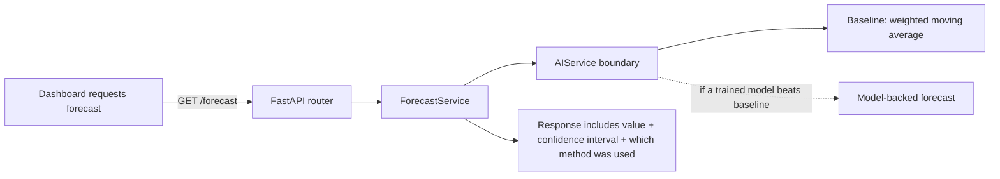
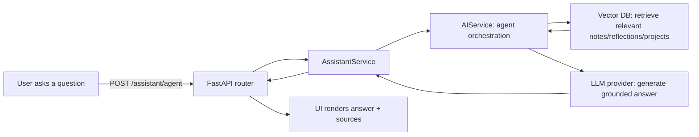

# PACI Learning Dashboard — Software Design Document (SDD)

**Document type:** SDD (architecture only — no application code)
**Owner:** Faisal
**Status:** Draft v1.0
**Based on:** PACI Learning Dashboard PRD v0.2 (approved) — this document does not redesign the product; it translates the approved PRD into architecture.

This document contains no React components, no CSS, and no implementation snippets. Entity "key fields" are listed as name/type pairs for schema planning purposes, not as code.

---

## 1. Executive Summary

**Architecture philosophy:** the system's *technical* complexity is staged on the same principle the PRD already established for its *product* complexity — nothing is built ahead of the requirement that justifies it. There is no backend until Phase 4 needs server-side inference. There is no vector database until Phase 9 needs retrieval over a real corpus. This isn't a constraint imposed on the architecture from outside; it's the same discipline applied one layer down.

**Primary design principles:**
- Simplicity over speculative abstraction — every abstraction (repository pattern, service boundary) is introduced at the point it earns its cost, not preemptively
- Feature-based organization on both frontend and backend, so each PRD "system component" is self-contained and resumable after a multi-week gap
- A stable data *shape* (Section 6) introduced early, independent of the storage *mechanism*, which is allowed to evolve underneath it
- AI capability isolated behind one service boundary from day one of its existence, so provider and technique can change without touching calling code
- Single-user now, schema-ready (not feature-ready) for more, later — see [Section 16, ADR-009](#16-architecture-decision-records-adr)

**Scalability goals — reframed deliberately:** this is a single-user application. "Scale" here does not mean concurrent users; it means **years of accumulated personal data** — thousands of study sessions, hundreds of competency records, a multi-year timeline — handled without degrading. Any strategy in this document aimed at multi-user concurrency would be solving a problem that doesn't exist yet; none is included.

**Maintainability goals:** resumable after a 2-week gap without re-onboarding (matches the PRD's non-functional requirement), consistent naming and folder conventions across frontend and backend, and small independently-shippable increments (Section 17) rather than long-running branches.

---

## 2. High-Level Architecture

The architecture has three distinct eras, matching the PRD's staged Database Planning — this is the single most important structural fact about the system, and every other section refers back to it.



The frontend never talks to the database or to an LLM provider directly — it only ever talks to its own StorageAdapter (Era 1) or to the FastAPI backend (Era 2+). This single rule is what keeps the Phase 3→4 transition (adding a real backend) from touching frontend business logic at all — only the StorageAdapter's implementation changes, from a local adapter to an HTTP-backed one.

---

## 3. System Components

| Component | Responsibility | Introduced |
|---|---|---|
| **Dashboard** | Aggregates status from other components into the home view; owns no data of its own | Phase 1 |
| **Learning Engine** | Phase/Module/StudySession tracking, schedule variance, velocity computation | Phase 1 |
| **Skill Engine** | Competency, Skill, and Knowledge Graph data and rollup computation (PRD §21) | Phase 1 (static graph) / Phase 2 (live) |
| **Projects** | Project entity lifecycle (planned → in progress → shipped/deployed) | Phase 1 |
| **Portfolio & Milestones** | Timeline aggregation and milestone auto-detection (PRD §22) | Phase 1 (milestones) / Phase 2 (timeline view) |
| **Knowledge Base** | Reflections and Knowledge Notes; becomes the RAG corpus in Phase 9 | Phase 1 (storage) / Phase 9 (retrieval) |
| **Analytics Engine** | Chart data, Metric Snapshots, Engineering Score computation | Phase 1 (minimal) / Phase 2 (full) |
| **Career Module** | Lightweight Career Readiness panel only — deliberately scoped down per PRD §23 | v2.1+, post-Phase-9 |
| **AI Services** | Forecasting, recommendations, assistant, RAG, agent — all behind one service boundary | Phase 4 onward, incrementally |
| **Authentication** | **Not built.** Schema-ready via a `User` entity (Section 6), no login flow exists through v2 | Deferred indefinitely |
| **Notification System** | **Not planned.** No requirement for this exists in the approved PRD; omitted rather than stubbed | Out of scope |

Two deliberate omissions from the SDD prompt's example list: Notification System has no product requirement behind it and isn't included even as a "future" placeholder — adding a placeholder for a feature with no validated need is itself a form of over-engineering. Authentication is schema-ready but explicitly not a component being built.

---

## 4. Frontend Architecture

**Folder organization** (feature-based, mirrored by the backend in Section 5):

```
src/
├── app/
│   ├── routes/           # route definitions, one per top-level nav item
│   └── store/            # Zustand store setup (Section 4, State Management)
├── features/
│   ├── dashboard/
│   ├── learning/         # Phase/Module/StudySession
│   ├── skills/           # Competency/Skill/Knowledge Graph
│   ├── projects/
│   ├── portfolio/        # Timeline + Milestones
│   ├── knowledge/        # Reflections + Knowledge Notes
│   ├── analytics/        # charts + Engineering Score
│   └── career/           # v2.1+, added when built
├── shared/
│   ├── components/ui/    # shadcn/ui primitives, never edited directly
│   ├── components/       # composed shared components (StatCard, MasteryBadge, etc.)
│   ├── hooks/
│   ├── lib/               # StorageAdapter, API client, date/format helpers
│   └── types/             # entity types shared across features
```

Each `features/*` folder is self-contained: its own components, hooks, and feature-local types. This is the folder-level expression of the PRD's "one system component per section" structure — a feature can be picked back up after weeks away without needing to remember how it touches five other folders.

**Component hierarchy philosophy:** shadcn/ui primitives form the base layer (installed into `shared/components/ui`, per shadcn's own convention of generating rather than importing them — never hand-edited beyond that generation step). Shared composite components (a progress bar, a mastery-stage badge, a stat card) live in `shared/components` and are used across features. Feature-specific components stay inside their feature folder. Route-level components compose feature components; they contain layout, not business logic.

**Routing strategy:** client-side routing (React Router), route table matching the PRD's navigation structure (§9) exactly:

| Route | Component source |
|---|---|
| `/` | dashboard |
| `/curriculum` , `/curriculum/:phaseId` | learning |
| `/study-log` | learning |
| `/projects` | projects |
| `/reflections` | knowledge |
| `/analytics` | analytics |
| `/growth` (tabs: `/growth/skills`, `/growth/graph`, `/growth/score`) | skills, analytics |
| `/portfolio` | portfolio |
| `/settings` | app-level, not a feature |

**State management — Zustand, recommended:**

Three options were evaluated, as requested:
- **Redux Toolkit** — rejected. Its middleware/dev-tooling ecosystem solves problems (time-travel debugging, complex async orchestration, large multi-developer teams coordinating on one store) that don't exist for a solo-maintained, single-user app. The boilerplate cost isn't justified by the problem size.
- **React Context alone** — sufficient through Phase 1 for the one or two genuinely global values (current phase, theme), but breaks down starting Phase 2: the command palette, streak widget, velocity chart, and Growth view all need to react to overlapping slices of state, and Context re-renders every consumer on any change to the provided value, which becomes a real performance and readability problem once that many independent widgets subscribe to it.
- **Zustand — recommended.** Minimal boilerplate (a real advantage for solo maintenance), selector-based subscriptions so a component only re-renders when the specific slice it reads changes, and no provider-wrapping ceremony. Introduced starting Dashboard Phase 2, not Phase 1 — Phase 1's state needs are simple enough that adding a state library on day one would itself be a small instance of the over-engineering this document is trying to avoid everywhere else.

**Data flow:** local/UI state lives in Zustand; **server state** (once a backend exists, Phase 4+) is recommended to be managed with TanStack Query rather than pushed into Zustand — this is an addition beyond the originally specified stack, justified because mixing server-cache concerns (staleness, refetching, optimistic updates) into a client-state store tends to produce exactly the kind of ad-hoc caching bugs a dedicated server-state library exists to prevent. Pre-Phase-4, "server state" doesn't exist (no server) — the StorageAdapter (below) is read directly.

**Pre-backend data layer (Phases 1–3):** a `StorageAdapter` interface, implemented first by a JSON-file/localStorage-backed adapter (Phase 1–2), then a SQLite-wasm-backed adapter (Phase 3) — both satisfying the same interface so feature code never changes when the adapter does. This is the frontend-side counterpart to the backend's repository pattern (Section 5), and it's what makes the eventual Phase 4 swap to a real API a matter of writing one new adapter, not rewriting feature logic.

**Reusable component philosophy:** composition over configuration — shared components take children and slots rather than sprawling prop APIs; feature components own their business logic and compose shared primitives, rather than shared primitives trying to anticipate every feature's needs.

---

## 5. Backend Architecture

Everything in this section applies from **Dashboard Phase 4 onward** — there is no backend before that (Section 2).

**API architecture:** FastAPI routers organized by feature (one router per `features/*` folder from Section 4's mirrored structure), kept thin — a router's job is request/response translation only, never business logic.

**Service layer:** business logic lives here as plain, framework-independent functions/classes — schedule variance calculation, Engineering Score computation, milestone-detection rules, mastery rollups. Framework-independence is deliberate: these are exactly the functions the Testing Philosophy (Section 13) prioritizes covering, and they should be testable without spinning up FastAPI or a database.

**Repository pattern (backend):** one repository per entity (Section 6), abstracting SQLAlchemy behind a narrow interface (`get`, `list`, `create`, `update`). This is what makes the SQLite→PostgreSQL transition (PRD §13) a matter of swapping the repository's underlying engine, not rewriting the service layer that was already validated against SQLite.

**Validation strategy:** Pydantic models validate all API request/response shapes. The frontend maintains its own lightweight schema validation (Phase 1–3, pre-backend) for local data integrity — these two validation layers are allowed to drift slightly out of sync before Phase 4 (a deliberate, bounded, low-cost tradeoff — see [Risks](#15-risks)) rather than building shared/codegenerated schemas across two different language ecosystems for a single-user app.

**Error handling:** domain-level exceptions (e.g., an invalid project status transition) are raised in the service layer and translated into HTTP responses by FastAPI exception handlers at the API boundary — the service layer never knows about HTTP status codes.

**Logging:** structured logging (not bare `print`), local file/stdout through Phase 8; centralized/hosted logging is explicitly not planned unless a real operational need appears — adding a logging platform for a single-user app's traffic would be solving a problem this system doesn't have.

**Configuration management:** environment variables via `.env` + `pydantic-settings`, distinct dev/prod configs, nothing hardcoded. Given the parent PACI repository is public, `.env` must be gitignored as a hard rule — this is a concrete instance of the PRD's public/private data boundary requirement, not a generic best practice.

**Dependency injection:** FastAPI's built-in `Depends` mechanism, used to wire repositories into services and services into routers. No separate DI framework — FastAPI's own mechanism is sufficient at this scale.

**Future AI integration layer:** an `AIService` interface sits behind the service layer. Concrete implementations (rule-based recommendation, LLM-backed forecasting, RAG retrieval, agent orchestration) are swapped in as the curriculum reaches the relevant phase, without callers (e.g., `RecommendationService`) needing to change. This is the architectural mechanism behind the PRD's repeated pattern of "start with a baseline, upgrade later, evaluate against the baseline."

---

## 6. Database Design

**Naming reconciliation, stated up front:** the SDD prompt's example entity list (User, Learning Path, Phase, Module, Lesson, Skill, Project, Study Session, Weekly Review, Achievement, Portfolio Item, Knowledge Note, Analytics Snapshot) is reconciled against the PRD's already-approved vocabulary rather than adopted verbatim, to avoid two names for the same concept:
- **Weekly Review → Reflection** (PRD term retained)
- **Achievement → Milestone** (PRD term retained — "Achievement" reads as gamification, which the PRD explicitly designed against)
- **Portfolio Item** — not a separate entity; the Portfolio Timeline is generated from Project, Milestone, and Skill events (PRD §22)
- **Lesson** — omitted. The PACI curriculum's finest granularity is Module (per the PACI repository README); adding a Lesson sub-level would be decomposing content the source curriculum doesn't itself break down that far. Add it later only if module-level tracking proves too coarse in practice.
- **User, Learning Path, Knowledge Note** — adopted as genuinely useful additions beyond the original PRD's explicit entity list, reasoned below.



| Entity | Purpose | Key relationships | Key fields | Future expansion |
|---|---|---|---|---|
| **User** | Owns all data; single row through v2 | Owns everything, directly or transitively | id, display_name, created_at | Auth fields (password hash, email) added only if Section 3's Authentication component is ever built |
| **LearningPath** | Container for a curriculum (PACI is the one seeded row) | Has many Phases | id, user_id (FK), name, official_duration, accelerated_target | The schema-level hook for future multi-curriculum support (PRD §24) — no UI or logic depends on there being more than one row |
| **Phase** | One of the 9 curriculum phases | Belongs to LearningPath; has many Modules, Projects | id, learning_path_id (FK), name, order, official_months, accelerated_weeks, status | — |
| **Module** | Sub-unit within a Phase | Belongs to Phase; has many Competencies, StudySessions | id, phase_id (FK), name, status, completed_at | Possible Lesson sub-level (see above), not built now |
| **Competency** | A granular, demonstrable capability | Belongs to Module; rolls up into a Skill | id, module_id (FK), skill_id (FK), description, mastery_stage (enum: introduced/practiced/applied/mastered), evidence_link | — |
| **Skill** | Aggregated mastery view for a category | Aggregates Competencies; references other Skills (dependency edges) | id, name, category | The `skill_dependency` join table is the Knowledge Graph's edge list |
| **StudySession** | An atomic logged unit of study time | Belongs to Phase, Module, Week | id, module_id (FK), date, duration_minutes, type (study/build/review), notes | — |
| **Project** | A portfolio deliverable | Belongs to Phase; has many Milestones, TimelineEvents | id, phase_id (FK), title, status (planned/in_progress/shipped), deployed (bool), deployed_url, repo_url | — |
| **Week** | Calendar grouping for reflections/velocity | Has many StudySessions; has one Reflection | id, start_date | — |
| **Reflection** | Structured weekly journal entry | Belongs to Week | id, week_id (FK), what_shipped, plan_vs_reality, next_change, is_public (bool) | `is_public` is the enforced public/private boundary from PRD §7 |
| **KnowledgeNote** | Durable reference note, separate from weekly reflections | Authored by User; optionally tagged to a Phase/Module | id, user_id (FK), title, body, tags, created_at | Becomes RAG corpus input at Phase 9 |
| **Milestone** | System-detected significant event | Triggered by a Project or Skill state change | id, type, source_entity_type, source_entity_id, detected_at | — |
| **TimelineEvent** | Denormalized feed record for the Portfolio Timeline | Generated from Project/Milestone/Skill changes | id, event_type, source_entity_type, source_entity_id, occurred_at | Not a primary data source — always derived |
| **MetricSnapshot** | Point-in-time computed metric (velocity, schedule variance, Engineering Score) | Belongs to Phase or User | id, phase_id (FK, nullable), type, value, breakdown (structured), computed_at | `breakdown` field exists specifically so the Engineering Score is never shown as an opaque number (PRD §21.5) |

---

## 7. API Design

REST, organized by feature, versioned under `/api/v1`. Applies from Dashboard Phase 4 onward only — Phases 1–3 have no API surface at all.

| Method | Path | Purpose |
|---|---|---|
| GET | `/learning-paths/{id}` | Fetch the active learning path with phase summaries |
| GET | `/phases/{id}` | Fetch a phase with its modules and status |
| PATCH | `/phases/{id}` | Update phase status (used by the phase-completion flow) |
| GET / POST | `/study-sessions` | List / log study sessions |
| GET / POST / PATCH | `/projects` | List, create, update projects |
| GET | `/competencies?module_id=` | List competencies for a module |
| PATCH | `/competencies/{id}` | Update a competency's mastery stage |
| GET | `/skills` | List skills with rolled-up mastery stage |
| GET | `/knowledge-graph` | Fetch the curated skill-dependency graph, with current mastery overlay |
| GET | `/milestones` | List detected milestones |
| GET | `/timeline` | Fetch the Portfolio Timeline feed (paginated) |
| GET / POST | `/reflections` | List / submit weekly reflections |
| GET / POST | `/knowledge-notes` | List / create knowledge notes |
| GET | `/analytics/snapshots` | Fetch metric snapshots for charting |
| GET | `/analytics/engineering-score` | Fetch current Engineering Score with breakdown |
| GET | `/forecast` | Estimated completion date + confidence interval (Phase 4+) |
| GET | `/recommendations` | Study recommendations, knowledge-graph-weighted (Phase 5+) |
| POST | `/assistant/query` | Single-shot retrieval assistant query (Phase 6+) |
| POST | `/assistant/agent` | Agent-orchestrated query (Phase 9+, replaces the above) |
| GET | `/career/readiness` | Career Readiness summary (v2.1+, added when built) |

No request/response bodies are specified here in detail (that's an implementation-time decision within the Pydantic models, Section 5) — this table defines the contract surface, not the payloads.

---

## 8. Data Flow

**Study session logging — Phases 1–3 (no backend):**



**Study session logging — Phase 4+ (backend exists):**



**Completion forecast request (Phase 4+):**



**RAG assistant query (Phase 9):**



---

## 9. Security Architecture

- **Authentication:** not implemented through v2 — single local user, no login flow. If the backend is ever deployed to a public URL (Vercel/Railway are reachable by default once deployed), a minimum-viable guard (a single static API key checked on every request) is a hard requirement before that deployment — not optional hardening.
- **Authorization:** not applicable at single-user scale. If PRD §24's generalization is ever pursued, authorization becomes a per-`User`-owns-`LearningPath` check — the schema (Section 6) already supports this without redesign.
- **Input validation:** Pydantic (backend) + a lightweight frontend schema check (pre-backend and post-backend alike) — never trust client input at the API boundary even though there's currently only one trusted client.
- **Secrets management:** all secrets (DB connection string, LLM API keys, GitHub token) live in `.env`, never committed — enforced doubly given the parent repository is public.
- **Environment variables (categories, not values):** database connection string, LLM provider API key(s), GitHub personal access token (for the read-only activity integration).
- **API protection:** CORS locked to the known frontend origin once a backend exists; rate limiting is explicitly not needed at single-user traffic volume and is omitted rather than pre-built.

---

## 10. Performance Strategy

- **Caching:** computed aggregates (Engineering Score, Skill rollups, velocity) are cached as MetricSnapshot records, not recomputed per page load — this was already a PRD requirement (§21.5), restated here as the performance mechanism it also is.
- **Lazy loading:** route-based code splitting — Growth, Portfolio, and Analytics views load on demand so the AI/RAG-heavy code (Phase 6+) never bloats the Phase 1 initial bundle.
- **Pagination:** Study Session log and Portfolio Timeline paginate once history exceeds roughly one screen — necessary given nine months of accumulated logging.
- **Optimistic updates:** study session logging and project status changes update the UI before persistence confirms, matching the PRD's "instantaneous" logging requirement.
- **Memoization:** applied selectively to genuinely expensive derived computations (Knowledge Graph layout, Skill rollup aggregation) — not applied blanket-wide, which creates its own noise and bugs.
- **Database optimization:** indexes on foreign keys and frequently-filtered columns (`phase_id`, `module_id`, `date`) once PostgreSQL exists; the SQLite era's data volume doesn't warrant this level of tuning.
- **Bundle optimization:** Vite's built-in code splitting and tree-shaking are sufficient; no custom bundler configuration or micro-frontend split is justified at this scale.
- **Future scalability — reframed (see Section 1):** every strategy above is sized for "years of one person's data," not concurrent-user load. None of this should be over-invested in relative to that actual data volume.

---

## 11. Error Handling Strategy

- **Client-side:** one error boundary per route; inline/toast messaging distinguishes a network failure from a validation failure from an unexpected exception, since the right user action differs for each.
- **Backend:** domain exceptions raised in the service layer, translated to HTTP status codes at the API boundary (Section 5); stack traces never returned to the client in production.
- **Validation:** field-level validation errors returned from the API, not a single generic "invalid request" message — the frontend schema layer mirrors this so pre-backend validation behaves the same way.
- **Network failures:** don't exist as a risk category in Phases 1–3 (no network dependency for core CRUD). From Phase 4 on: one automatic retry, then an explicit, actionable error — never a silent failure, directly enforcing the PRD's "never silently drop a logged entry" requirement.
- **Unexpected exceptions:** caught at the top level, logged with enough context to reproduce (feature, action, timestamp — never the content of a private reflection), and shown to the user as a calm, specific-enough message ("something went wrong saving this — your other data is safe") rather than a raw stack trace or a generic toast.
- **Recovery:** local-first storage in Phases 1–3 means there's no network dependency to recover from; Phase 4+ leans on optimistic local state as a buffer against transient backend downtime.

---

## 12. AI Architecture

Every AI capability sits behind the single `AIService` boundary defined in Section 5. No calling code talks to an LLM SDK, vector store, or embedding model directly.

- **Recommendation engine (Phase 5):** rule-based baseline first, weighted by Knowledge Graph position (a weak foundational skill outranks a weak downstream one — PRD §10). Any future model-backed version is evaluated against this baseline before it's trusted, not assumed superior.
- **Study assistant (Phase 6):** single-shot retrieval — pull the most relevant KnowledgeNotes/Reflections (by tag/recency, not yet embeddings) and answer using them in one pass. No agent loop, no vector database yet — introducing either before Phase 6 needs them would be infrastructure ahead of the skill to operate it.
- **RAG pipeline (Phase 9):** formalized — ingestion (chunking notes, reflections, and project write-ups), embedding, vector storage, retrieval, and generation, all behind `AIService`.
- **Vector database:** introduced at Phase 9 only. The Phase 6 assistant's simpler retrieval is a deliberate, honest stepping stone, not a placeholder pretending to be RAG.
- **Prompt management:** prompts live in one location adjacent to the `AIService` implementations, not scattered through calling code — a full prompt-versioning system is not built, since a solo-maintained local app can redeploy on any prompt change without the coordination problem such a system exists to solve.
- **LLM providers:** Anthropic/OpenAI, abstracted behind `AIService` so the provider can change without touching `ForecastService`, `RecommendationService`, or `AssistantService`.
- **Agent orchestration (Phase 9):** a bounded agent with a small, fixed tool set (query the knowledge base, query progress data, suggest a review item) — not a general-purpose agent framework. The actual requirement is a personalized tutor with a handful of well-defined actions, and building for a broader agent platform than that is exactly the kind of scope this document has argued against everywhere else.
- **Evaluation:** the forecasting baseline comparison (already specified) is the evaluation mechanism for Phase 4. For the assistant/RAG (Phase 6/9), a small, manually-curated set of question/answer pairs is used to sanity-check retrieval quality before it's trusted — not a formal ML evaluation framework, which would be disproportionate for a single-user tool.

---

## 13. Development Standards

- **Naming conventions:** PascalCase for React components and TypeScript types; camelCase for TS variables/functions; snake_case for Python; kebab-case for file and folder names.
- **Folder conventions:** feature-based, as defined in Sections 4 and 5 — frontend and backend folder structures mirror each other by feature name.
- **Component conventions:** shadcn/ui primitives in `components/ui` are treated as generated, not hand-edited beyond their initial generation; customization happens in wrapper components in `shared/components`.
- **Git strategy:** trunk-based with short-lived feature branches. No GitFlow-style long-running branches — that model solves multi-contributor coordination problems this solo project doesn't have.
- **Branch naming:** `phase-N/short-feature-name`, tying branches directly to the PACI/dashboard phase structure — useful given the parent repository's own "public engineering journal" framing.
- **Commit conventions:** Conventional Commits (`feat:`, `fix:`, `docs:`, `refactor:`, `test:`) — directly implements the "meaningful commits" Engineering Standard already defined in the PACI repository README.
- **Documentation expectations:** every feature folder gets a short README, mirroring the PACI repo's own per-project README standard. Architecture Decision Records (Section 16) are updated whenever a decision changes, not just written once and left stale.
- **Testing philosophy:** Vitest for frontend business logic (schedule variance, mastery rollup, score computation) — not UI snapshot tests, which churn too fast pre-stability to be worth maintaining. Pytest for backend service-layer logic once it exists, for the same reason: test the logic most likely to have subtle bugs, skip testing thin API/UI glue that a manual click-through would catch just as fast.

---

## 14. Version Roadmap

Architecture-level view of the PRD's Version Planning (§17) — what infrastructure exists at each version, explicitly bounded to avoid scope creep:

| Version | Infrastructure state |
|---|---|
| v0.1–v0.3 | Static SPA, StorageAdapter (JSON → SQLite-wasm), no backend, no auth, no AI |
| v1.0 | FastAPI backend introduced; PostgreSQL; repository/service layers; baseline forecasting behind `AIService` |
| v1.x | Recommendation service (rule-based, knowledge-graph-weighted); single-shot retrieval assistant; statistical advanced analytics (no new infra) |
| v1.x (optional) | OCR ingestion, isolated as its own optional service — not a dependency of anything else |
| v2.0 | Full RAG pipeline; vector database; bounded agent orchestration |
| v2.1+ | Career Readiness panel — data-derived, no new infrastructure beyond entities already in Section 6 |

**Explicitly not on this roadmap, at any version:** multi-tenancy, an authentication flow, a notification system, a general-purpose agent framework. These are not deferred features waiting for a later version slot — they're excluded because no version of the approved PRD requires them.

---

## 15. Risks

- **Premature abstraction in Phases 1–3.** The StorageAdapter pattern is right, but applying it as a multi-implementation abstraction on day one (before a second implementation exists) would be speculative. Mitigation: build it with exactly one implementation (JSON) until Phase 3 actually needs a second.
- **Frontend/backend schema drift.** The Phase 1–3 local data shape and the eventual PostgreSQL schema could drift if not deliberately kept aligned. Mitigation: Section 6's entity definitions are treated as the single source of truth from Phase 1 onward, independent of which storage mechanism currently implements them.
- **AI boundary leakage.** A shortcut where a service method calls an LLM SDK directly instead of going through `AIService` would quietly undermine the whole point of Section 12. Mitigation: this is a discipline risk with no automated enforcement in a solo codebase — worth a periodic manual check, called out explicitly rather than assumed away.
- **Validation schema drift (frontend/backend, pre-Phase-4).** Accepted as a deliberate, bounded tradeoff (Section 5) — revisit only if it actually causes bugs, not preemptively.
- **Local-storage migration debt.** The Phase 3 SQLite migration needs a real, budgeted data-migration step (Section 17), not an assumption that it happens for free alongside other work.
- **Knowledge Graph / Skill rollup cost if computed naively.** Cheap at current scale, but should be cached (Section 10) from the point it's introduced, not retrofitted later once it's already a habit to recompute on every render.
- **AI Architecture (Section 12) is the single biggest complexity cliff in the whole roadmap.** It deserves a focused implementation window at Phase 9, not a squeeze-in alongside other Phase 9 curriculum work — flagged here so it isn't underestimated during sprint planning (Section 17).

---

## 16. Architecture Decision Records (ADR)

**ADR-001 — React + TypeScript + Vite for the frontend.**
*Context:* need a fast solo-development loop and an ecosystem with strong React Query/Zustand/shadcn support. *Decision:* confirmed as proposed in the PRD. *Consequences:* fast iteration; TypeScript pays for itself once Section 6's entity count grows past a couple of types.

**ADR-002 — No backend until Dashboard Phase 4.**
*Context:* the PRD's own staged Database Planning already established this. *Decision:* carried through architecturally — no FastAPI service exists, deployed or not, before Phase 4. *Consequences:* zero idle infrastructure cost for ~5 months of curriculum time; the Phase 3→4 transition is the one deliberate architectural discontinuity in the whole roadmap.

**ADR-003 — FastAPI over Django/Flask/Node for the backend.**
*Context:* Python is already the curriculum's own language from Phase 4 onward. *Decision:* FastAPI — async-native (useful for future AI service calls), lighter than Django for a single-purpose API, and doesn't introduce a second backend language. *Consequences:* one language across ML/AI curriculum work and backend work.

**ADR-004 — SQLite before PostgreSQL, both later than originally proposed.**
*Context:* PRD §13 already deferred SQLite to Phase 3 (not day one). *Decision:* carried through architecturally via the StorageAdapter/Repository pattern. *Consequences:* zero-ops database for a single user through Phase 3; PostgreSQL only arrives when FastAPI does, since a backend is required to justify a network-facing database.

**ADR-005 — Zustand over Redux Toolkit and plain Context.**
*Context:* multiple independent widgets (command palette, streak, velocity chart, Growth view) need overlapping state slices starting Phase 2. *Decision:* Zustand, introduced Phase 2. *Consequences:* minimal boilerplate, selector-based re-renders, no provider ceremony; Redux's middleware ecosystem and Context's broad re-render behavior are both avoided.

**ADR-006 — Feature-based organization, frontend and backend.**
*Context:* PRD Maintainability NFR requires resumability after multi-week gaps. *Decision:* one folder per system component (Section 3), mirrored across frontend and backend. *Consequences:* a feature's full logic lives in one place; the cost is some duplication of shared utilities across features, accepted as worthwhile.

**ADR-007 — Repository pattern (backend) / StorageAdapter pattern (pre-backend frontend).**
*Context:* the storage mechanism changes three times across the roadmap (JSON → SQLite-wasm → PostgreSQL) while the data shape stays constant. *Decision:* both patterns exist specifically to isolate that change from business/service logic. *Consequences:* each storage transition is a new adapter/repository implementation, not a rewrite.

**ADR-008 — Vector database deferred to Phase 9, not introduced earlier.**
*Context:* the Phase 6 assistant could technically use embeddings sooner. *Decision:* deferred anyway — introducing retrieval infrastructure before the curriculum has taught it would contradict this system's core philosophy (Section 1). *Consequences:* the Phase 6 assistant is a genuine, honest stepping stone (simple retrieval) rather than a disguised early version of Phase 9's RAG pipeline.

**ADR-009 — Generic-shaped entities (`LearningPath`, `User`) despite a single-user, single-curriculum v1–v2.**
*Context:* the SDD's product context frames this as an eventual "AI Engineering Operating System," while the approved PRD (§24) explicitly recommends staying PACI-specific in scope and naming through v2. *Decision:* reconcile by keeping the *schema* generic (a `LearningPath` row, a `User` row) while building *no* multi-curriculum or multi-user functionality — no curriculum switcher, no login flow, no per-user isolation logic. *Consequences:* the long-term "engineering companion" vision is satisfied at the data-model level, which is nearly free, without pulling forward the UI/functional work the PRD explicitly says to defer until a second real curriculum exists to design against.

**ADR-010 — Reconciled entity naming vs. the SDD prompt's example list.**
*Context:* the prompt's example entities (Achievement, Portfolio Item, Lesson, Weekly Review) don't match the PRD's already-approved vocabulary (Milestone, Timeline Event, Reflection) for the same concepts. *Decision:* keep the PRD's terms; treat the prompt's examples as illustrative, not literal. *Consequences:* one vocabulary across PRD and SDD, avoiding the confusion of two names for one thing.

**ADR-011 — Authentication and Notification System out of scope through v2.**
*Context:* both appear as "future" examples in the SDD prompt's System Components list. *Decision:* Authentication is schema-ready (the `User` table) but has no login flow; Notification System is omitted entirely — no requirement for it exists anywhere in the approved PRD. *Consequences:* neither consumes implementation time before there's a validated need; both are cheap to add later precisely because the schema didn't need to be redesigned to add them.

---

## 17. Implementation Roadmap

Sprints are detailed only through Dashboard Phase 1 — planning Phase 2 through Phase 9 sprint-by-sprint today would mean forecasting nine months of work in detail before the first line of code exists, which is its own form of over-engineering. Phase 2 onward is grouped at the Dashboard-Phase level and re-planned into sprints at the start of that phase, matching standard iterative practice.

**Sprint 1 — Scaffold.** Vite + React + TS + Tailwind + shadcn/ui initialization; folder structure (Section 4); `StorageAdapter` interface with a JSON implementation; base layout shell (sidebar, top bar, command palette skeleton). *Leaves the app in a working state:* an empty but navigable shell.

**Sprint 2 — Curriculum & Study Log.** Seed the 9 phases/modules from the PACI repository README; read-only Curriculum view; Study Session logging (form + list), wired to the StorageAdapter. *Working state:* a user can browse the curriculum and log real study time.

**Sprint 3 — Reflections & Projects.** Weekly Reflection flow (structured prompts, chronological journal); Project tracker CRUD; basic home Dashboard (current phase card, streak, recent activity). *Working state:* the core PRD Phase 1 "Must" features are complete.

**Sprint 4 — Phase 1 close-out.** Data export (JSON/Markdown); minimal Engineering Score (project count + deployment only); Milestone auto-detection on Project state changes; static Knowledge Graph reference view. *Working state:* Dashboard Phase 1 is fully shipped per the PRD's Feature Breakdown.

**Sprint Group — Dashboard Phase 2 (re-plan at kickoff):** Analytics charts, Competency tracking (replacing binary module-complete), Skill Tree, full Engineering Score (adds GitHub + documentation scoring), Portfolio Timeline view.

**Sprint Group — Dashboard Phase 3:** SQLite-wasm StorageAdapter implementation + data migration from the Phase 1–2 JSON store.

**Sprint Group — Dashboard Phase 4:** FastAPI backend stand-up; repository and service layers; PostgreSQL; baseline forecasting behind `AIService`.

**Sprint Groups — Dashboard Phases 5–9:** re-planned at each phase's kickoff, per the Version Roadmap (Section 14) and AI Architecture (Section 12). Phase 9 in particular should be scoped as its own dedicated sprint group, not folded into general "AI phase cleanup," per the complexity risk already flagged in Section 15.

---

## Summary

This SDD makes one architectural choice that governs almost every other one in the document: **there is no backend before Dashboard Phase 4.** Every pattern here — the StorageAdapter mirroring the eventual Repository pattern, the stable entity shape independent of storage mechanism, the AI service boundary that doesn't exist until there's something real behind it — exists to make that deferral cheap to reverse later rather than a wall to climb over when Phase 4 arrives. The architecture is staged the same way the product is: not because simplicity is a virtue in the abstract, but because every layer here is meant to be built with the skill the curriculum has actually taught by the time it's needed.
